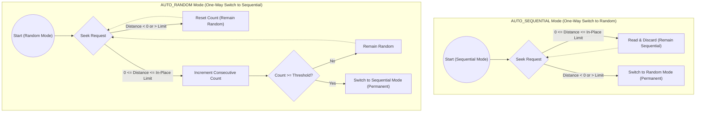

# Adaptive Read Strategy

## Configuration Knobs

*   `analytics-core.read.file-access-pattern`: Can be forced to strictly `RANDOM` or `SEQUENTIAL`, or left on the adaptive defaults `AUTO_SEQUENTIAL` or `AUTO_RANDOM`.
*   `analytics-core.adaptive-read.sequential-read-threshold`: The number of consecutive sequential reads required to switch from random mode to sequential mode when configured with `AUTO_RANDOM` (Default: 3).
*   `analytics-core.read.inplace-seek-limit-bytes`: If a forward seek is smaller than this limit (Default: 128KB), the stream will read and discard the bytes rather than closing and opening a new network connection.

## How it Works
`gcs-analytics-core` implements an adaptive read strategy within [`GoogleCloudStorageInputStream`](../../core/src/main/java/com/google/cloud/gcs/analyticscore/core/GoogleCloudStorageInputStream.java). The stream continuously monitors the application's read patterns and dynamically adjusts its underlying network requests to Google Cloud Storage to balance throughput and network efficiency.

To prevent strategy oscillation and unpredictable I/O behavior, each adaptive configuration allows **only a single, one-way state transition** during the lifecycle of an open stream:

*   **Sequential Mode (`AUTO_SEQUENTIAL`)**: The stream starts in sequential mode and proactively fetches larger chunks of data into an internal buffer. This improves throughput for full-table scans by keeping the TCP connection saturated and minimizing the number of individual network GET requests. If a non-contiguous seek is detected (a backward seek or a forward seek exceeding the in-place seek limit), the stream **switches once** to random mode and **remains in random mode permanently** for the rest of the stream lifecycle.
*   **Random Mode (`AUTO_RANDOM`)**: The stream starts in random mode, fetching only the exact bytes requested by the application. This prevents wasting network bandwidth and memory on data that will never be consumed. If the stream observes enough consecutive sequential reads (`analytics-core.adaptive-read.sequential-read-threshold`), it **switches once** to sequential mode and **remains in sequential mode permanently** for the rest of the stream lifecycle.

### State Transitions and In-Place Seeks

The stream acts as a state machine where each adaptive mode (`AUTO_SEQUENTIAL` or `AUTO_RANDOM`) permits **only a single, one-way state transition** during the stream's lifecycle. Once the stream transitions to a new mode, it locks into that mode permanently.

**In-Place Seeks (Read and Discard)**
When the stream is in Sequential Mode and a forward `seek()` occurs, it must decide whether to establish a new network connection for the new offset or keep the existing connection open. Closing and reopening a network connection is relatively expensive.

If the seek distance is small (less than `analytics-core.read.inplace-seek-limit-bytes`), the stream will simply read and discard the intermediate bytes from the existing connection. This is faster than dropping the connection and establishing a new one, thereby maintaining the high throughput of Sequential Mode.

## Internal Implementation Details

The core logic of this feature is decoupled from the stream itself and implemented using the Strategy pattern in the `client` module:

*   **[`ReadStrategy`](../../client/src/main/java/com/google/cloud/gcs/analyticscore/client/ReadStrategy.java)**: The base interface defining operations for reading and seeking data.
*   **[`AdaptiveReadStrategy`](../../client/src/main/java/com/google/cloud/gcs/analyticscore/client/AdaptiveReadStrategy.java)**: A composite strategy that tracks heuristics (like consecutive sequential reads and seek distances) and performs a one-way switch of the underlying network I/O delegate between the sequential and random strategy based on the observed access pattern.
*   **[`SequentialReadStrategy`](../../client/src/main/java/com/google/cloud/gcs/analyticscore/client/SequentialReadStrategy.java)**: The implementation for `AUTO_SEQUENTIAL` and `SEQUENTIAL` modes. It actively buffers data ahead of the application's read requests to maximize TCP throughput.
*   **[`RandomReadStrategy`](../../client/src/main/java/com/google/cloud/gcs/analyticscore/client/RandomReadStrategy.java)**: The implementation for `AUTO_RANDOM` and `RANDOM` modes. It issues exact-byte network `GET` requests for the requested bounds.
*   **[`AbstractReadStrategy`](../../client/src/main/java/com/google/cloud/gcs/analyticscore/client/AbstractReadStrategy.java)**: Provides common base functionality for the concrete implementations.
